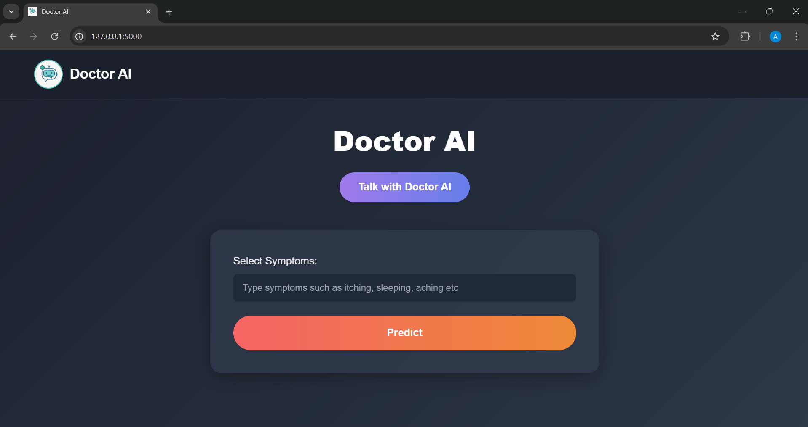
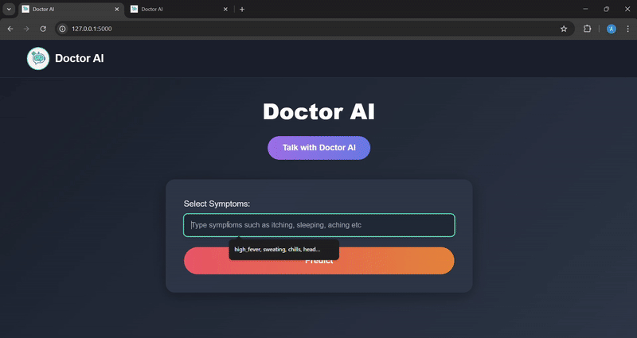
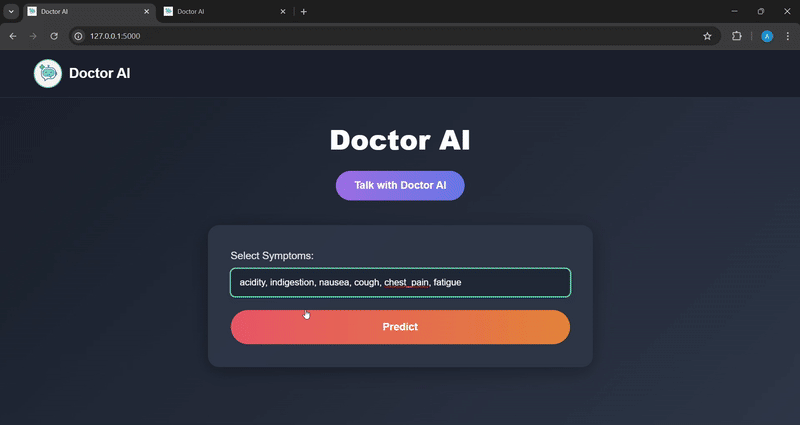
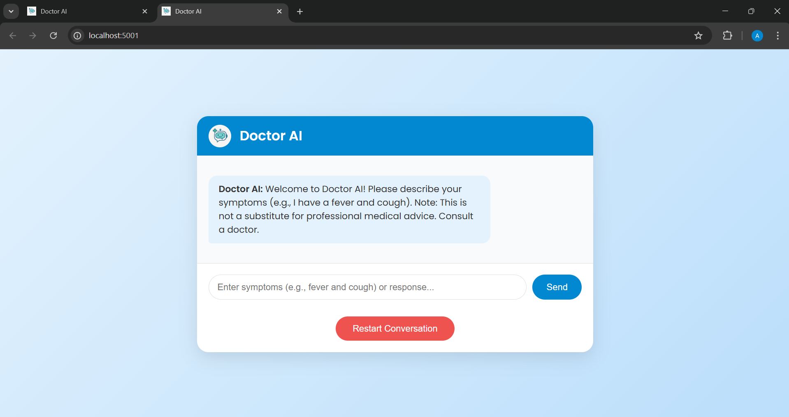
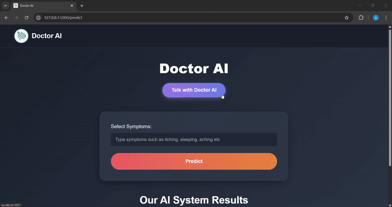
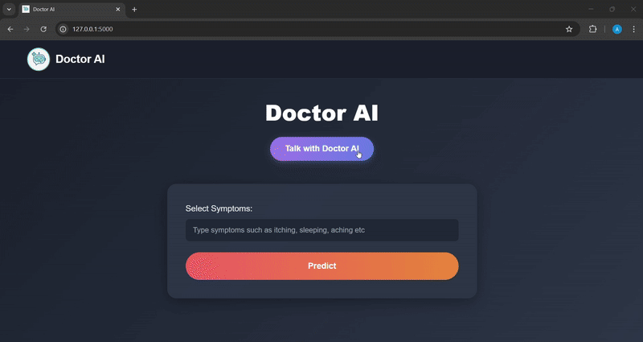

# **Medicine Recommendation System with Chatbot**

*A Machine Learning + NLP powered healthcare assistant*

---

## **Project Summary**

The **Medicine Recommendation System with Chatbot** is a full-stack healthcare application built using **Machine Learning** and **Natural Language Processing** to assist users in obtaining preliminary medical guidance.

The system predicts diseases using structured symptom inputs and provides personalized **medications, precautions, diet plans, and workout recommendations**.

Additionally, an intelligent **Doctor AI Chatbot** handles **free-text symptom descriptions**, understands them using **Sentence Transformers (MiniLM)**, and matches user queries semantically using **cosine similarity**, enabling natural conversations and multi-turn interactions.

This project integrates **ML + NLP + Flask** and is built as a **Final Year Project (June 2024 – May 2025)**.

---

# **Key Features**

### **1. Disease Prediction using ML**

* Uses **Support Vector Machine (SVM)** for high-dimensional symptom vectors
* Achieved **high accuracy** on the dataset
* Predicts diseases based on **132 binary symptoms**
* Provides **medication, diet, workout & precaution recommendations**

### **2. Chatbot (NLP Module)**

* Accepts **free-text** symptom descriptions (e.g., "I have headache and nausea")
* Uses **Sentence Transformer (MiniLM-L6-v2)** for semantic understanding
* Performs cosine similarity to detect the closest disease
* Multi-turn dialogue (e.g., user says “Yes”, “No”, “Tell me more”)
* Triggers medication, precaution and explanation templates

### **3. Flask Web Application**

* Disease prediction page
* Chatbot interface
* Fast response & easy UI
* Runs two modules:

  * `main.py` → UI + ML prediction
  * `chatbot.py` → NLP chatbot API

### **4. GIF Demonstrations**

Live demos of prediction & chatbot interactions (screenshots below).

---

# **How the System Works**

## **1. Machine Learning Flow (SVM Model)**

✔ Dataset from Kaggle with **4,920 records**, **132 symptoms**, and **41 diseases**

✔ Each disease encoded into a **binary 132-dimensional vector**

✔ Train/test split: **80:20**

✔ Best performing model: **SVM (Linear Kernel)** due to high-dimensional sparse data

✔ Evaluation metrics: accuracy, precision, recall, F1-score

✔ Final model saved as `svc.pkl`

> Why SVM?
> Because SVM performs exceptionally well on **high-dimensional**, **linearly separable** symptom data and gives the most stable prediction results.

---

## **2. NLP Chatbot Flow**

### Step 1 — User enters free-text input

Example:

> "I have fever, headache, and fatigue."

### Step 2 — Convert input to semantic embedding

Using **MiniLM Sentence Transformer**

### Step 3 — Compare with disease symptom descriptions

Compute **cosine similarity** between the input embedding and dataset embeddings.

### Step 4 — Threshold-based matching

If similarity `< 0.3` → chatbot asks for clarification
If similarity `≥ 0.3` → disease detected

### Step 5 — Multi-turn conversation

* User says "Yes" → chatbot gives medications
* User says "No" → chatbot refines
* User says "Tell me precautions" → chatbot responds

*This logic is based on your carefully written dataset & templates.* 

---

# **System Architecture**

```
                         ┌────────────────────────────┐
                         │        User Interface      │
                         │  (HTML/CSS/Flask Templates)│
                         └─────────────┬──────────────┘
                                       │
                                       ▼
                         ┌───────────────────────────┐
                         │     Flask Backend (UI)    │
                         │        main.py (5000)     │
                         └─────────────┬─────────────┘
             Disease Prediction Routes │
                                       │
                                       ▼
                         ┌───────────────────────────┐
                         │  ML Model (SVM - svc.pkl) │
                         │ Symptom Vector Prediction │
                         └─────────────┬─────────────┘
                                       │
                                       │
                      Chatbot Requests │  (API Call)
                                       ▼
                         ┌───────────────────────────┐
                         │   Flask Chatbot Server    │
                         │      chatbot.py (5001)    │
                         └─────────────┬─────────────┘
                                       │
                                       ▼
                         ┌───────────────────────────┐
                         │ Sentence Transformer Model│
                         │      (MiniLM-L6-v2)       │
                         └─────────────┬─────────────┘
                                       │
                                       ▼
                         ┌───────────────────────────┐
                         │ NLP Dataset (Custom CSVs) │
                         │ Medicines, Precautions,   │
                         │ Descriptions Templates    │
                         └───────────────────────────┘
```

---

# **Folder Structure**

```
medicine_recommendation_system/
│
├── app/
│   ├── main.py
│   ├── chatbot.py
│   ├── model.py
│
├── data/
│   ├── dataset.csv
│   ├── description.csv
│   ├── diets.csv
│   ├── medications.csv
│   ├── medications_data.csv
│   ├── precautions.csv
│   ├── precautions_df.csv
│   ├── Symptom-severity.csv
│   ├── symtoms_df.csv
│   ├── Training.csv
│   ├── workout_df.csv
│
├── models/
│   ├── svc.pkl
│
├── notebooks/
│   ├── Medicine Recommendation System.ipynb
│
├── screenshots/
│   ├── home.png
│   ├── chat.png
│   ├── home_prediction_result.gif
│   ├── home_prediction_result1.gif
│   ├── chat_prediction_result.gif
│   ├── chat_prediction_result1.gif
│
├── static/
│   ├── styles.css
│   └── logo.png
│
├── templates/
│   ├── index.html
│   ├── chat.html
│
│
├── requirements.txt
└── README.md
```

---

# **Screenshots & GIF Demo**

### **Home Page**



---

### **Disease Prediction Result 1**



---

### **Disease Prediction Result 2**



---

### **Chatbot Interface**



---

### **Chatbot Prediction Demo 1**



---

### **Chatbot Prediction Demo 2**



---

# **Installation & Setup**

### **1. Clone the repository**

```bash
git clone https://github.com/armaan-pathan/medicine-recommendation-system.git
cd medicine-recommendation-system
```

### **2. Install dependencies**

```bash
pip install -r requirements.txt
```

### **3. Install spaCy model**

```bash
python -m spacy download en_core_web_sm
```

### **4. Run the ML UI server (port 5000)**

```bash
python app/main.py
```

### **5. Run the chatbot server (port 5001)**

```bash
python app/chatbot.py
```

### Open in browser:

```
http://127.0.0.1:5000
```

---

# **Technologies Used**

### **Backend**

* Flask
* Python

### **Machine Learning**

* scikit-learn (SVM classifier)
* numpy
* pandas

### **NLP**

* Sentence Transformers (MiniLM-L6-v2)
* spaCy
* Cosine similarity

### **Frontend**

* HTML / CSS
* Flask Templates

---

# **Challenges Faced**

* No publicly available dataset with symptoms + meds + precautions → manually built dataset
* Handling vague, incomplete user messages
* Creating realistic symptom descriptions
* Choosing correct similarity thresholds
* Managing multi-turn chatbot logic
* Avoiding overfitting in the SVM model
* Ensuring fast inference for Transformer embeddings

---

# **Key Learnings**

* Real-world dataset creation and cleaning
* Model selection based on high-dimensional data
* Semantic search & sentence embedding logic
* UI/Backend integration
* Deployment-ready Flask architecture
* Conversation flow design for chatbots

---
